# 🛒 Customer Shopping Behavior Analysis

## 📌 Project Overview

This project analyzes **customer shopping behavior** using transactional data from **3,900 purchases** across multiple product categories.  
The goal is to uncover actionable insights related to:

- Customer spending patterns  
- Product performance  
- Discount and subscription behavior  
- Customer segmentation  
- Revenue drivers  

The project combines **Python (ETL & cleaning)**, **MySQL (EDA)**, and **Power BI (dashboarding)** to simulate a real-world end-to-end data analytics workflow (Cleaning → Analysis → Business Insights → Dashboard).

---

## 🛠️ Tools & Technologies Used

- **Programming & Analysis:** Python (Pandas, NumPy), Jupyter Notebook 
- **Database & Querying:** MySQL, MySQL Workbench  
- **Data Visualization:** Power BI  
- **Presentation & Storytelling:** Gamma AI  
- **Documentation & Version Control:** Markdown, GitHub

---

## 📂 Dataset Summary

- **Rows:** 3,900  
- **Columns:** 18  
- **Key Features:**
    - **Customer Demographics** (Age, Gender, Location, Subscription Status)
    - **Purchase Details** (Item Purchased, Category, Purchase Amount, Season, Size, Color)
    - **Shopping Behavior** (Discount Applied, Promo Code Used, Previous Purchases, Frequency of Purchases, Review Rating, Shipping Type)

  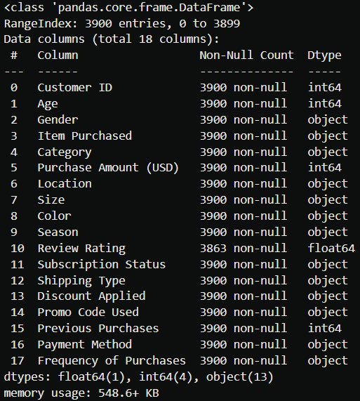

---

## 🐍 Explore Transform and Load (Python)

ETL and data preparation were performed using **Python (Pandas & NumPy)**.\
Checkout the complete [Python Script](Data_ETL.ipynb) for more detailed steps.

### Overview of Steps Performed

#### 1. Data Loading & Initial Exploration
- Imported the dataset using `pandas`.
- Checked structure with `df.info()`.
- Identified missing values using `df.isna().sum()`.
- Generated statistical summaries using `df.describe()`.

#### 2. Column Standardization
- Converted all column names to **snake_case**.
- Improved consistency and SQL compatibility.

#### 3. Handling Missing Values
- Imputed missing values in `review_rating`.
- Used **median rating within each product category** to keep the imputation of nulls more realistic.

#### 6. Data Type Optimization

- Standardized column data types to improve **consistency, memory efficiency, and query performance**.
- Reduced dataset size from **~548 KB to ~207 KB**, improving storage efficiency and downstream SQL performance.

#### 5. Data Consistency Checks
- Identified duplicate information between:
  - `discount_applied`
  - `promo_code_used`
- Dropped `promo_code_used` to avoid redundancy.

#### 6. Feature Engineering
- Created `age_group` by binning customer ages.
- Derived `purchase_frequency_days` by mapping the purchase frequency column.

#### 7. Database Integration
- Exported the cleaned DataFrame to **MySQL**.
- Enabled structured, scalable SQL analysis.

---

## 🗄️ Exploratory Data Analysis using SQL (MySQL)

Using MySQL, targeted queries were written to answer real business questions.\
For more details and queries used checkout the [SQL Script](Data_EDA.sql).

### Key Business Questions Answered

- **Revenue by Gender**  
  Compared total revenue generated by male vs female customers

  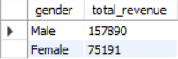

- **High-Spending Discount Users**  
  Identified customers who used discounts but still spent above the average purchase amount

  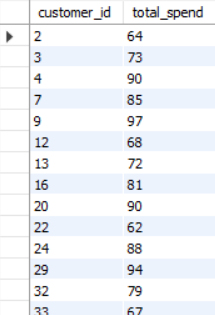

- **Top 5 Products by Rating**  
  Found products with the highest average customer ratings

  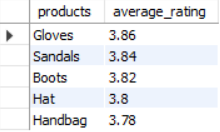

- **Shipping Type Comparison**  
  Compared average purchase amounts between Standard and Express shipping

  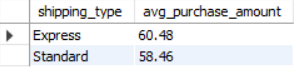

- **Subscribers vs Non-Subscribers**  
  Analyzed average spend and total revenue by subscription status

  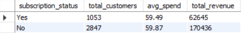

- **Discount-Dependent Products**  
  Identified 5 products with the highest percentage of discounted purchases

  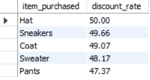

- **Customer Segmentation**
  Classified customers into:
    - New  
    - Returning  
    - Loyal  

  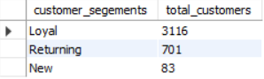

- **Top 3 Products per Category**  
  Ranked the most purchased products within each category

  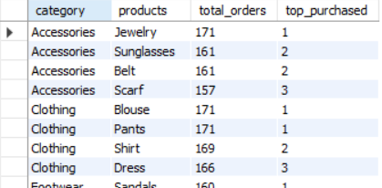

- **Repeat Buyers & Subscriptions**
  Checked whether customers with more than 5 purchases are more likely to subscribe

  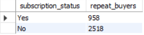

- **Revenue by Age Group**
  Calculated total revenue contribution from each age group

  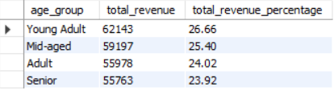

---

## 📊 Power BI Dashboard

An [**interactive Power BI dashboard**](Customer_Shopping_Behavior_Dashboard.pbix) was created to visualize insights, including:

- Revenue breakdowns  
- Customer segmentation  
- Subscription comparisons  
- Product performance  
- Shipping behavior  

The dashboard allows dynamic filtering for deeper exploration and decision-making.

  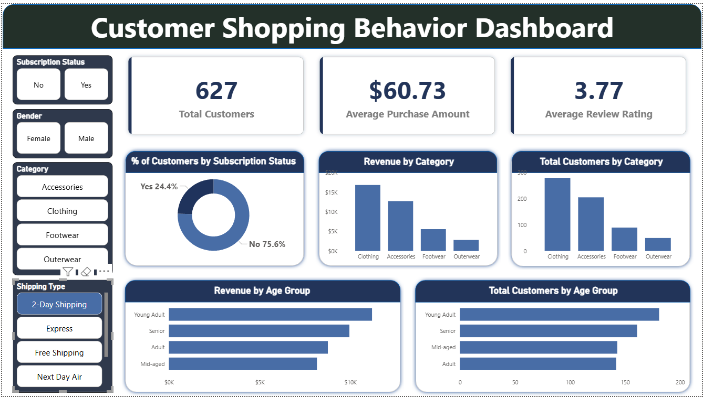

---

## 💡 Business Recommendations

Based on the analysis, the following strategies are recommended:

- **Encourage Subscriptions**  
  Promote exclusive benefits to increase subscriber conversions

- **Strengthen Loyalty Programs**  
  Incentivize repeat customers to move into the “Loyal” segment

- **Optimize Discount Strategy**  
  Balance promotions to drive sales without impacting profitability

- **Product Positioning**  
  Highlight top-rated and best-selling products in marketing campaigns

- **Targeted Marketing**  
  Focus campaigns on high-value age groups and customers preferring express shipping

---